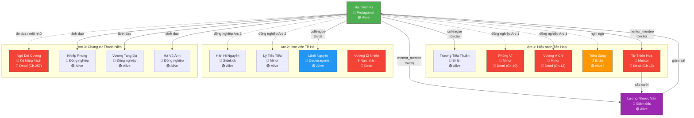

```mermaid
graph TD
    C001["Hạ Thiên Kì<br/>👤 Protagonist<br/>🟢 Alive"]
    C002["Trương Tiểu Thuận<br/>🔎 Bí ẩn<br/>🟢 Alive"]
    C003["Phùng Vĩ<br/>👤 Minor<br/>🔴 Dead (Ch.10)"]
    C004["Vương Á Chi<br/>👤 Minor<br/>🔴 Dead (Ch.12)"]
    C005["Triệu Sảng<br/>❓ Bí ẩn<br/>🟢 Alive?"]
    C006["Từ Thiên Hoa<br/>🧙 Mentor<br/>🔴 Dead (Ch.13)"]
    C007["Lương Nhược Vân<br/>👑 Giám đốc<br/>🟢 Alive"]
    C008["Hàn Hi Nguyên<br/>👤 Sidekick<br/>🟢 Alive"]
    C009["Lý Tiếu Tiếu<br/>👤 Minor<br/>🟢 Alive"]
    C010["Lãnh Nguyệt<br/>🔮 Deuteragonist<br/>🟢 Alive"]
    C011["Vương Di Nhiên<br/>💀 Nạn nhân<br/>🔴 Dead"]
    
    C061["Ngô Đại Cương<br/>👤 Kẻ hống hách<br/>🔴 Dead (Ch.257)"]
    C062["Nhiếp Phong<br/>👤 Đồng nghiệp<br/>🟢 Alive"]
    C063["Vương Tang Du<br/>👤 Đồng nghiệp<br/>🟢 Alive"]
    C064["Hà Vũ Ảnh<br/>👤 Đồng nghiệp<br/>🟢 Alive"]

    C001 -->|"mentor_mentee<br/>tôi/chú"| C006
    C001 -->|"colleague<br/>tôi/cậu"| C002
    C001 -->|"mentor_mentee<br/>tôi/chị"| C007
    C001 -->|"colleague<br/>tôi/cô"| C010

    C001 -.->|"đồng nghiệp Arc 1"| C003
    C001 -.->|"đồng nghiệp Arc 1"| C004
    C001 -.->|"nghi ngờ"| C005

    C001 -.->|"đồng nghiệp Arc 2"| C008
    C001 -.->|"đồng nghiệp Arc 2"| C009
    
    C001 -->|"lãnh đạo"| C062
    C001 -->|"lãnh đạo"| C063
    C001 -->|"lãnh đạo"| C064
    C001 -.->|"đe dọa / mồi nhử"| C061

    C006 -->|"cấp dưới"| C007
    C007 -->|"giám sát"| C001

    subgraph "Arc 1: Hiệu sách Tân Hoa"
        C002
        C003
        C004
        C005
        C006
    end

    subgraph "Arc 2: Học viện Tề Hà"
        C008
        C009
        C010
        C011
    end

    subgraph "Arc 3: Chung cư Thanh Niên"
        C061
        C062
        C063
        C064
    end

    style C001 fill:#4CAF50,stroke:#333,color:#fff
    style C003 fill:#f44336,stroke:#333,color:#fff
    style C004 fill:#f44336,stroke:#333,color:#fff
    style C006 fill:#f44336,stroke:#333,color:#fff
    style C011 fill:#f44336,stroke:#333,color:#fff
    style C007 fill:#9C27B0,stroke:#333,color:#fff
    style C010 fill:#2196F3,stroke:#333,color:#fff
    style C005 fill:#FF9800,stroke:#333,color:#fff
    style C061 fill:#f44336,stroke:#333,color:#fff
```
